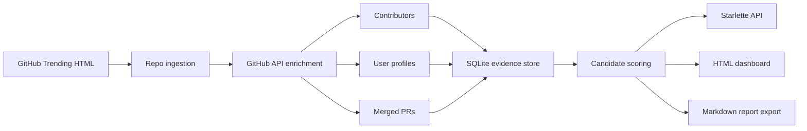

# GH Trending Talent

GH Trending Talent is a GitHub Trending analytics prototype for finding promising open-source engineers. It turns public repository, contributor, profile, and pull request signals into a ranked candidate list with evidence for why each person may be relevant.

## What, Why, And Who

Raw GitHub data is noisy: trending repositories are project-centered, repository owners are often organizations, and contributor lists alone do not explain who is recently active.

GH Trending Talent converts public GitHub signals into a candidate-centered view:

- Collects GitHub Trending repositories.
- Enriches them with contributors, public user profiles, and recent merged pull requests.
- Filters organizations and bots.
- Ranks human candidates with explainable evidence.

This is useful for:

- Talent sourcers looking for open-source engineers.
- Engineering managers or CTOs who want evidence-backed hiring leads.
- Developer relations or platform teams tracking active contributors.

Technical system:



## Run Locally

Create and activate a virtual environment:

```bash
python3 -m venv venv
source venv/bin/activate
pip install -r requirements.txt
```

A GitHub token is recommended for live profile and PR enrichment:

```bash
export GITHUB_TOKEN=...
```

Run ingestion and start the web service:

```bash
python -m gh_trending_talent.cli ingest \
  --languages python typescript go \
  --limit 10 \
  --max-contributors 5 \
  --max-pull-requests 2 \
  --replace

python -m gh_trending_talent.cli serve --host 127.0.0.1 --port 8000
```

Then open:

- Dashboard: http://127.0.0.1:8000/
- Talent API: http://127.0.0.1:8000/api/talent
- Trends API: http://127.0.0.1:8000/api/trends
- Markdown report: http://127.0.0.1:8000/report.md

Useful URLs:

- http://127.0.0.1:8000/?sort=confidence
- http://127.0.0.1:8000/?sort=pr
- http://127.0.0.1:8000/?domain=product
- http://127.0.0.1:8000/api/talent?sort=ecosystem
- http://127.0.0.1:8000/api/talent?domain=developer%20tools

If GitHub is unavailable, add `--offline` to seed the database with realistic sample data:

```bash
python -m gh_trending_talent.cli ingest --offline
```

For a larger run:

```bash
python -m gh_trending_talent.cli ingest \
  --languages python javascript typescript go rust \
  --limit 50 \
  --max-contributors 10 \
  --max-pull-requests 2 \
  --replace
```

Use `--replace` for a clean run; omit it to accumulate/update existing rows. Without `GITHUB_TOKEN`, GitHub API rate limits are low and profile/PR enrichment can return zero records.

Optional AI account review is only used for ambiguous human/bot/organization classification:

```bash
GROQ_API_KEY=... python -m gh_trending_talent.cli ingest \
  --languages python go rust \
  --limit 10 \
  --ai-filter
```

## Repository Contents

- `gh_trending_talent/ingest.py`: collects GitHub Trending repositories.
- `gh_trending_talent/storage.py`: SQLite schema and persistence.
- `gh_trending_talent/analytics.py`: candidate-first recruiting logic and supporting technology trends.
- `gh_trending_talent/github_accounts.py`: GitHub API profile, contributor, and merged PR enrichment.
- `gh_trending_talent/app.py`: web dashboard and JSON/Markdown delivery.
- `gh_trending_talent/cli.py`: reproducible commands for ingestion, reporting, and serving.
- `gh_trending_talent/sample_data.py`: offline sample data for demos and grading.
- `get_evidence.py`: one-time CrewAI demand-validation workflow used before building the product.
- `evidence.txt`: generated demand-evidence summary from the research workflow.
- `requirements.txt`: Python dependencies for local setup.
- `templates/dashboard.html`: product dashboard.
- `static/styles.css`: dashboard styling.

## Demand Evidence Artifacts

`get_evidence.py` was used once before product implementation to collect AI-assisted demand evidence with CrewAI, Groq, and Serper. It generated `evidence.txt`, which is referenced by the final project report.

These research dependencies are not included in `requirements.txt` because they are not needed to run GH Trending Talent. To rerun the demand-validation workflow:

```bash
pip install crewai crewai-tools groq python-dotenv
export GROQ_API_KEY=...
export SERPER_API_KEY=...
python get_evidence.py
```

## Talent Scoring Logic

GH Trending Talent treats repositories as evidence, not as the final product. Each candidate is built from contributor, profile, and merged-PR signals:

- **Human account filter**: GitHub API `type == Organization` is excluded; bot and automation names such as `dependabot[bot]` are excluded; AI is used only for uncertain profiles when `--ai-filter` is enabled.
- **Weighted impact score**: repo momentum is multiplied by contributor-rank weight, so the first GitHub contributor receives more credit than the twentieth.
- **PR score**: recent merged pull requests add candidate-specific evidence, which reduces dependence on repo-level popularity alone.
- **Breadth score**: score for projects, languages, and total current attention.
- **Ecosystem score**: combines language market weight, language rarity in the current evidence pool, attention, and language mix.
- **Profile strength**: signal from followers, public repos, name, and bio.
- **Confidence score**: 0-100 evidence confidence from project count, language count, weighted impact, and human confidence.
- **Role fit**: maps language mix into recruiter-friendly labels such as full-stack product engineer, infrastructure engineer, or backend/AI platform engineer.
- **Domain filter**: filters evidence repositories by keywords such as product, payments, LLM infra, or developer tools.

## Storage Model

GH Trending Talent uses local SQLite at `data/gh_trending_talent.sqlite`.

Tables:

- `repositories`: daily GitHub Trending repository snapshots.
- `github_profiles`: GitHub user metadata plus human/bot/organization classification.
- `pull_requests`: recent merged PR evidence by repository and PR number.

Ingestion uses SQLite upserts: existing repository/profile/PR rows are updated, and new rows are inserted. `--replace` clears all three tables before storing the current run. Without `--replace`, evidence accumulates. The dashboard reads the latest `snapshot_date` by default.

Database files under `data/` are local generated artifacts and are ignored by git. Regenerate them with the ingest command instead of committing them.

## Credits, Ethics, And References

GH Trending Talent uses only public GitHub repository and account metadata. It does not access private repositories, private emails, private organization data, or paid GitHub data.

`get_evidence.py` and `evidence.txt` are included to document the demand-validation process for the course report. They are not required to run the GH Trending Talent application.

- Treat candidates as leads, not hiring decisions. The score is a sourcing signal, not proof of competence or employability.
- Do not infer protected attributes such as age, gender, nationality, ethnicity, religion, health, or political views.
- Respect GitHub rate limits and terms. Use a read-only token for public data and cache results locally.
- Provide opt-out and correction paths in a production version.
- Avoid contacting people based only on automated ranking. Recruiters should review the public evidence first.
- Keep API keys out of Git. Use `.env` or environment variables such as `GITHUB_TOKEN`.

Primary data/API references:

- GitHub Trending: https://github.com/trending - used as the source of trending repositories by language.
- GitHub REST API: https://docs.github.com/en/rest - used for public contributor, user profile, pull request, and rate-limit behavior.
- SQLite UPSERT documentation: https://www.sqlite.org/lang_upsert.html - used for reproducible local storage and incremental updates.
- Starlette and Uvicorn: https://www.starlette.io/ and https://www.uvicorn.org/ - used to serve the local dashboard and JSON endpoints.
- Beautiful Soup: https://www.crummy.com/software/BeautifulSoup/bs4/doc/ - used to parse GitHub Trending HTML pages.
- HTTPX: https://www.python-httpx.org/ - used for HTTP requests to GitHub pages and APIs.

Core implementation stack: SQLite, Starlette/Uvicorn, HTTPX, Beautiful Soup, Jinja, and optional Groq SDK for `--ai-filter`.
